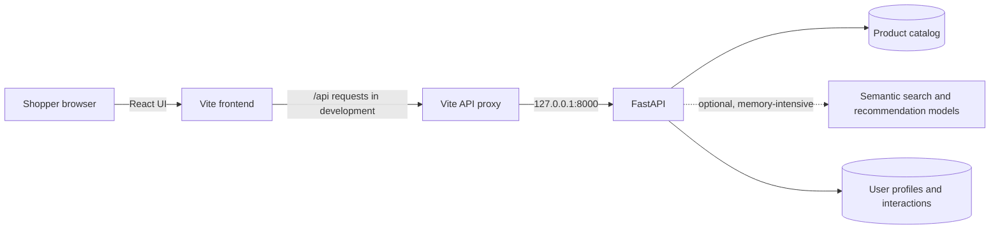

<div align="center">

# ShopGraph

### Find the right product by what you mean - not just what you type.

An AI-powered product discovery and recommendation experience combining a React storefront, a FastAPI catalog API, semantic search, and personalized ranking.

<br />


</div>

---

## At a glance

ShopGraph is a product discovery application built around a simple idea: useful shopping results should reflect a shopper's intent and interests, not just match a keyword. Browse a live catalog, search with natural language, explore recommendations, and view a lightweight shopping profile.

| Experience | What it does |
| --- | --- |
| **Live catalog** | Loads and displays products from the FastAPI service. |
| **Semantic search** | Sends a natural-language query to the backend search engine. |
| **Personalized recommendations** | Uses product embeddings and user signals to rank recommendations when the recommendation engine is enabled. |
| **Shopping profile** | Displays profile information returned by the API. |
| **Interaction signals** | Records search and cart events to inform personalization. |

## How it works



In development, the browser sends relative `/api/...` requests to the frontend origin. Vite forwards them to FastAPI, which avoids browser requests to a Codespace's `127.0.0.1`. API routes already include the `/api` prefix; the proxy preserves it.

## Tech stack

- **Frontend:** React, TypeScript, Vite, React Router, Framer Motion, and Lucide icons
- **Backend:** Python, FastAPI, and Uvicorn
- **Product data:** Pandas and Parquet files read with Fastparquet
- **AI/search (optional):** NumPy, FAISS, PyTorch, Hugging Face Transformers, and Sentence Transformers

## Get started

### Prerequisites

- Python 3.10 or newer
- Node.js and npm
- ShopGraph's processed product data files (see [Data files](#data-files))

### 1. Install backend dependencies

For the API, product catalog, and user interaction endpoints:

```bash
python -m pip install --upgrade pip
python -m pip install "fastapi" "uvicorn[standard]" pandas fastparquet
```

For semantic search or to enable the recommendation engine, install the additional AI packages:

```bash
python -m pip install numpy faiss-cpu torch transformers sentence-transformers
```

> **Codespace memory note:** The recommendation engine loads product metadata, embeddings, a FAISS index, and a MiniLM model. It is disabled by default so the catalog API can start on memory-limited machines. Enable it only when the environment has enough memory:
>
> ```bash
> SHOPGRAPH_ENABLE_RECOMMENDATIONS=true python -m uvicorn backend.api:app --host 0.0.0.0 --port 8000
> ```
>
> Without that setting, catalog and health endpoints can still be used; recommendations return `503`. Semantic search loads its model when first requested and also needs the optional AI dependencies.

### 2. Install frontend dependencies

```bash
npm install
```

### 3. Start the backend

From the repository root:

```bash
python -m uvicorn backend.api:app --host 0.0.0.0 --port 8000
```

Wait for `Application startup complete` before testing the API.

### 4. Start the frontend

In a second terminal at the repository root:

```bash
npm run dev
```

Open the Vite URL printed in the terminal. In GitHub Codespaces, open the forwarded frontend port (5173). Keep the backend running on port 8000; Vite forwards `/api` requests to it.

## Configuration

Development uses the Vite proxy configured in `vite.config.ts`; no `.env` file or API key is needed for the catalog. `.env.example` documents an optional API-origin override:

```dotenv
VITE_API_BASE_URL=
```

Leave it empty for the development proxy. For a separately hosted production frontend, set `VITE_API_BASE_URL` to the API **origin only**, such as `https://api.example.com` - do not append `/api`, because endpoint paths already include it. Frontend environment variables are bundled into browser code; never put secrets in `VITE_*` values.

The Hugging Face model can be downloaded when AI features load. `HF_TOKEN` is optional and may improve Hub rate limits; it is not an API key required by the ShopGraph catalog.

## API reference

The API is served on port `8000`. Interactive documentation is available at `/docs` while the backend is running.

| Method | Route | Purpose |
| --- | --- | --- |
| `GET` | `/api/health` | Service and component status |
| `GET` | `/api/products?limit=12&offset=0` | Paginated product catalog |
| `GET` | `/api/products/{asin}` | Product details |
| `POST` | `/api/search` | Semantic product search |
| `POST` | `/api/recommendations` | Personalized recommendations (requires engine enabled) |
| `GET` | `/api/users/{user_id}/profile` | User profile |
| `POST` | `/api/interactions` | Record a user interaction |
| `GET` | `/api/users/{user_id}/history` | User interaction history |

Example catalog request:

```bash
curl "http://localhost:8000/api/products?limit=5"
```

To verify browser-to-backend routing through Vite:

```bash
curl "http://localhost:5173/api/products?limit=5"
```

The second request should return JSON. If it returns the Vite HTML page, check that the Vite proxy is present in `vite.config.ts` and restart the frontend server.

## Data files

The backend looks for processed data in either `data/processed/` or `data/raw/processed/`. The product API requires:

- `products_text_fixed.parquet`

The optional recommendation engine also expects:

- `product_embeddings_fixed.npy`
- `embedding_product_ids_fixed.parquet`
- `search/faiss_products_fixed.index`
- `user_profiles.parquet`
- `user_interactions.parquet`

The recommendation engine searches both supported processed-data locations. Keep these paths and filenames intact, or update the data-path configuration to match your setup.

## Project layout

```text
backend/                 FastAPI app, schemas, and data-path helper
src/
  api/                   Typed frontend API client
  components/            Product, navigation, modal, and status UI
  recommendation/        Recommendation engine V3.1
  search/                Semantic search implementation
  App.tsx                Storefront, search, profile, and cart pages
  styles.css             Application styling
data/                    Processed catalog and model artifacts
user/                    User interaction tracking
vite.config.ts           Vite server and development API proxy
```

## Common troubleshooting

| Symptom | Check |
| --- | --- |
| Backend exits with `Killed` during recommendation loading | Leave `SHOPGRAPH_ENABLE_RECOMMENDATIONS` unset; the full model and data set can exceed Codespace memory. |
| `/api/products` returns `503` | Confirm the backend completed startup and the processed product Parquet file exists. |
| Port `5173` returns HTML for `/api/products` | Confirm the `/api` proxy in `vite.config.ts`, then stop and restart Vite. |
| Browser reports `import.meta.env` type errors | Confirm `src/vite-env.d.ts` references `vite/client`, dependencies are installed, and restart the TypeScript server. |
| Search or recommendations are unavailable | Install optional AI dependencies and check backend logs; recommendations additionally require `SHOPGRAPH_ENABLE_RECOMMENDATIONS=true` and adequate memory. |

## Production build

```bash
npm run build
npm run preview
```

Set `VITE_API_BASE_URL` to the production API origin when building a frontend that will not use the Vite development proxy. Run the API behind an appropriate production ASGI server or hosting setup; the development proxy is not a production API gateway.

## License

See [LICENSE](LICENSE).
